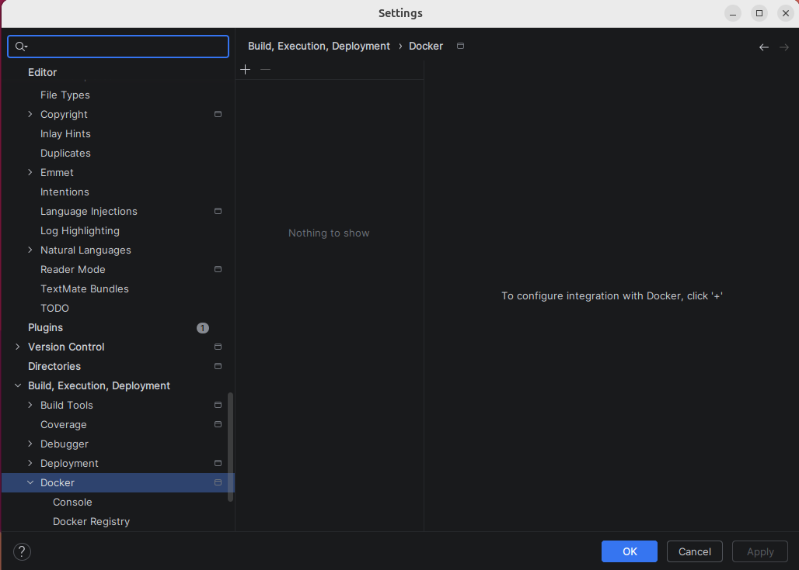
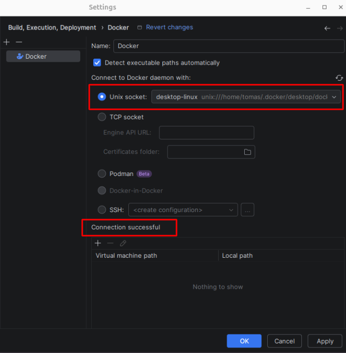
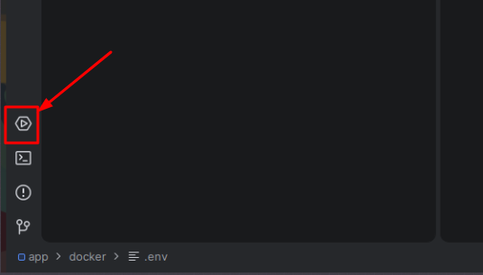
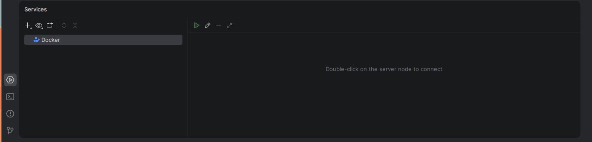
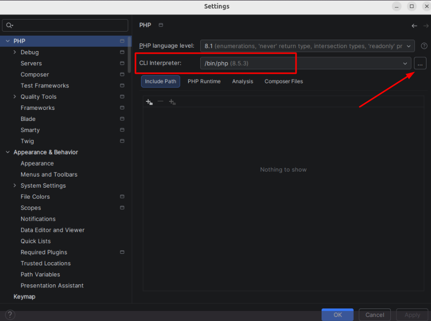
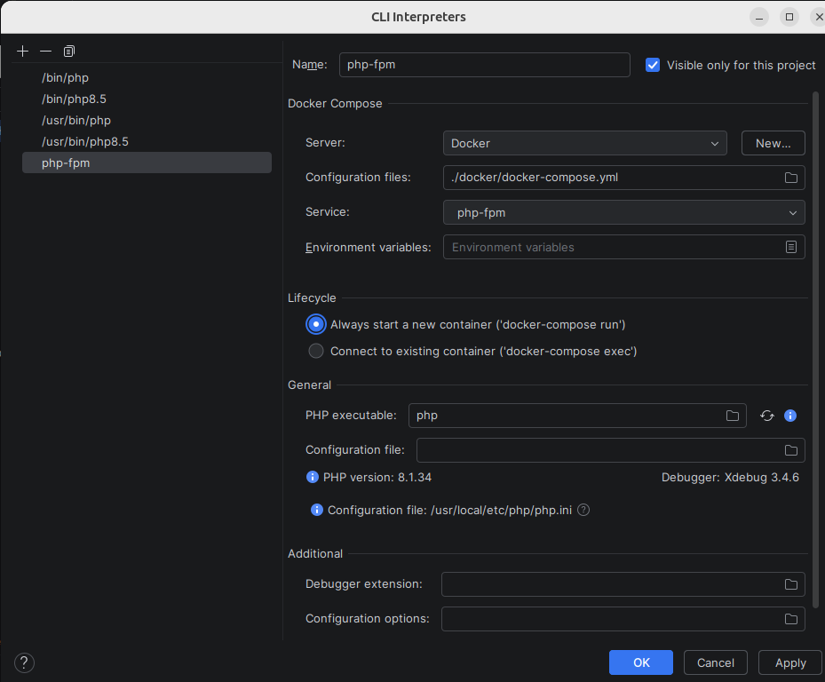

# PHPStorm plugin
1. .env files [https://plugins.jetbrains.com/plugin/9525--env-files]
2. Neon [https://plugins.jetbrains.com/plugin/28338-neon]

# PHPStorm konfigūracija
Naudojant docket PHPStorm turi būti sukonfigūruotas, kad vietoje standartinių HOST servisų būtų naudojami docker servisai

# Docker konfigūracija
Įsijungus pirmą kartą PHPStorm reikia prijungti docker servisą, kad PHPStorm matytų veikiančius docker container
1. Atsidarome PHPStorm nustatymus (angl. "Settings")

1. Atsidarius nustatymus paieškoje įrašius "Docker" reikia atsidaryti Docker konfigūracijos langą. Konfigūracijos valdymas (Build, Execution, Deployment -> Docker). 

2. Užėjus pirmą kartą konfigūracijos langas bus tuščias, puslapio viršuje reikia paspausti "+" mygtuką

3. Laukelyje "Unix socker" pasirenkame "desktop-linux", jeigu sėkmingai PHPStorm mato docker, konfigūracijos apačioje bus rodomas pranešimas "Connection successful" 

4. Spaudžiame "Apply" ir "OK" (uždaromas settings langas)

5. Puslapio apačioje pasirenkame "Services", matome naujai pridėtą servisą "Docker" 

6. Spaudžiame šalia esantį "Connect" mygtuką, jeigu docker container yra veikiančių, bus pateiktas sąrašas visų aktyvių konteinerių 

# PHP-CLI konfigūracija
1. Atsidarius nustatymus paieškoje įrašius "PHP" reikia atsidaryti PHP konfigūracijos langą. Konfigūracijos valdymas (PHP)

2. Dešinėje pusėje turėtų būti nurodyta eilutė "CLI Interpreter", spaudžiame dešinėje esantį "..." mygtuką atidaryti CLI konfigūracijos langą 

3. Naujame lange kairėje pusėje viršuje spaudžiame "+" mygtuką pridėti naują CLI interpreratorių

4. Pasirenkame "From Docker, Vagrant, VM, WSL, Remote..."

5. Pasirenkame "Docker Compose" variantą

6. Sukonfigūruojame naują CLI:
    - "Server" - paliekame Docker
    - "Configuration files" - turime pasirinkti projekto su kuriuo dirbsime "docker-compose.yml" failą. Atsidarome dešinėje esantį katalogo ženkliuką, kairėje pasirenkame "+" ir nueiname iki projekto, kuriame dirbame "Docker" katalogo (kelias: Projects/[PROJECT-NAME]/app/docker/docker-compose.yml), pasirenkame ir spaudžiame "OK"
    - "Service" - jeigu pridėtas teisingai "docker-compose.yml" bus pateiktas sąrašas servisų, kurie šiame docker-compose aprašyti. Turi būti pasirinktas servisas: "php-fpm"

7. Spaudžiame "OK", sistema pradės tikrinti pasirinktą servisą ar jis turi įdiegtą PHP, XDEBUG. Suradus reikiamus duomenis, bus atvaizduojamas naujas langas su informacija rasta pasirinktame servise. 

8. Kadangi "docker-compose.yml" kiekvienam projektui skirtingas, patikriname, kad viršuje būtų pažymėta varnelė "Visible only for this project". Taip pat rekomenduoju pervadinti CLI interpretatorų į aiškų pavadinimą, kad jis naudojamas docker pvz: "Docker PHP-8.1" (PHP versija pagal projekte veikiančią PHP versiją)

9. Spaudžiame "Apply" ir "OK"
